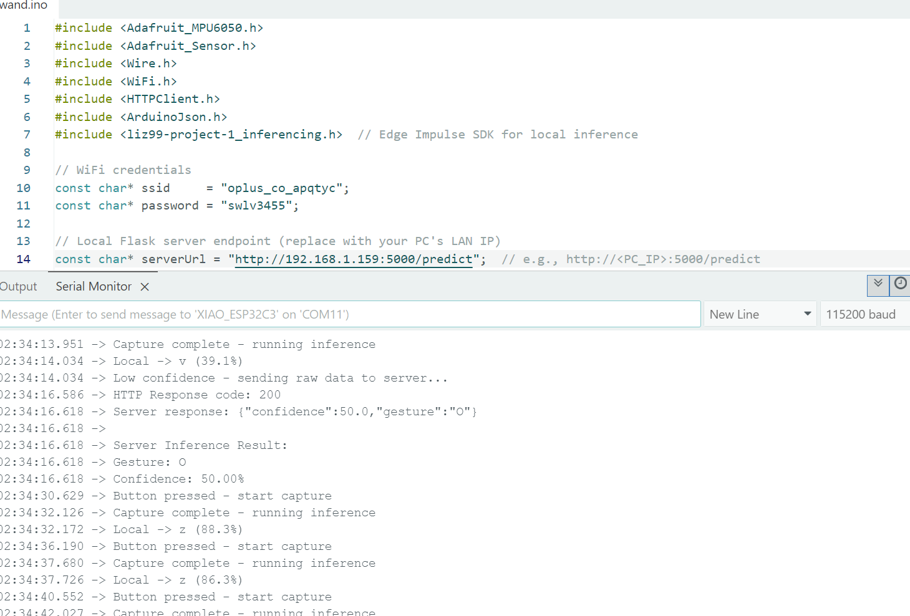
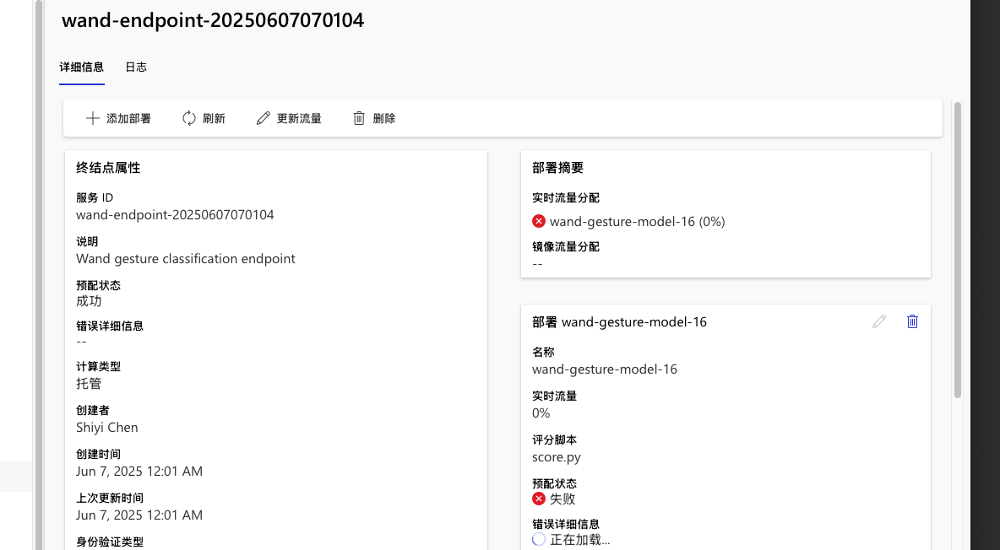

# Lab 5 Edge-Cloud Offloading — Quick Setup

This quick setup outlines five steps to get your Flask server and ESP32 sketch running.

---

### 1. Clone Repository

```bash
git clone https://github.com/SyHilichurl/515lab5b/git
```

Contains:

* `trainer_scripts/` (deployment scripts)
* `gesture/` (data) 
* `app/` (Flask server)
* `wand/` (ESP32 sketch)

---

### 2. Train & Deploy Model on Azure

1. Upload your dataset to Azure ML Blob via the Data tab.
2. Run `trainer_scripts/train.ipynb` to produce `wand_model.h5`.
3. Open and execute `model_register.ipynb`:

   * Provide subscription ID, resource group, and workspace name.
   * Register the model and create an online endpoint with a deployment.
4. Copy the endpoint URL and primary key from the **Consume** tab.

---

### 3. Start Local Flask Server (for Testing)

```bash
cd app
python -m venv .venv
source .venv/bin/activate      # Windows: .\.venv\Scripts\activate
pip install flask numpy arduinojson
python app.py
```

* The server listens on `0.0.0.0:5000`.
* Test via `http://<PC_IP>:5000/predict`.

---

### 4. Configure & Upload ESP32 Sketch

1. Open `wand/wand.ino` in Arduino IDE.
2. Install Arduino libraries:

   * Adafruit MPU6050
   * ArduinoJson
   * Copy `liz99-project-1_inferencing` into your Arduino libraries folder.
3. Update Wi-Fi and server settings at the top of the sketch:

```cpp
const char* ssid      = "<YOUR_WIFI_SSID>";
const char* password  = "<YOUR_WIFI_PASSWORD>";
const char* serverUrl = "http://<PC_IP>:5000/predict";  // or Azure endpoint URL
#define CONFIDENCE_THRESHOLD 80.0
```

4. Compile and upload. Open Serial Monitor at 115200 baud.

---

### 5. Test & Cleanup

* **Press** the pushbutton: observe `Local -> ...` or `Low confidence -> ...` plus server response in Serial Monitor.
* **Stop** the Flask server (`Ctrl+C`).
* **Disconnect** the ESP32.


Failed at the last step



## Discussion

### 1. Server vs. Wand Confidence
- **Observation**  
  - The wand’s local inference confidence can be low and fluctuate significantly (e.g. dropping from 78.8% down to 55.9%).  
  - The server’s confidence tends to be higher and more stable (e.g. around 50% or above).
- **Hypothesized Reason**  
  - The cloud model is typically larger, trained on more aggregated data, and runs on more powerful hardware, resulting in more calibrated and confident predictions.  
  - The ESP32’s on-device model is compressed and runs with limited compute, so its confidence scores are more conservative and sensitive to noise.

### 2. Data Flow Diagram

```plaintext
[MPU6050 Sensor]
    ↓ (x, y, z samples @100 Hz)
[ESP32 Capture Buffer]
    ↓ (151 samples × 3 features)
[ESP32 run_classifier()]
    ├─ if confidence ≥ 80% → LED pattern (edge inference)
    └─ else → HTTP POST JSON → 
[Flask Server - POST /predict]
    ↓ parse JSON → model.predict() → return JSON
[ESP32 HTTP response]
    ↓ LED pattern (cloud inference)
```

### 3. Edge-First, Fallback-to-Server Pros & Cons

| Aspect                    | Pros                                                      | Cons                                                           |
|---------------------------|-----------------------------------------------------------|----------------------------------------------------------------|
| **Connectivity Dependence** | • Works offline for high-confidence cases<br>• Reduces cloud traffic | • Requires network for low-confidence cases, may fail if offline |
| **Latency**               | • Local inference is very fast (<100 ms)                  | • Cloud round-trip adds 200–500 ms, may hurt interactivity      |
| **Prediction Consistency** | • Deterministic on-device results                         | • Two different models can disagree, confusing user experience  |
| **Data Privacy**          | • Raw sensor data stays on device for most cases          | • Raw data is sent to cloud when offloading, raising privacy concerns |

### 4. Mitigation Strategy
- **Reduce Network Reliance**:  
  Implement **offline request queuing**. If the HTTP POST fails, store the feature payload in local flash (NVS) and retry when connectivity resumes. This ensures no data is lost during temporary network outages and maintains seamless inference behavior.
